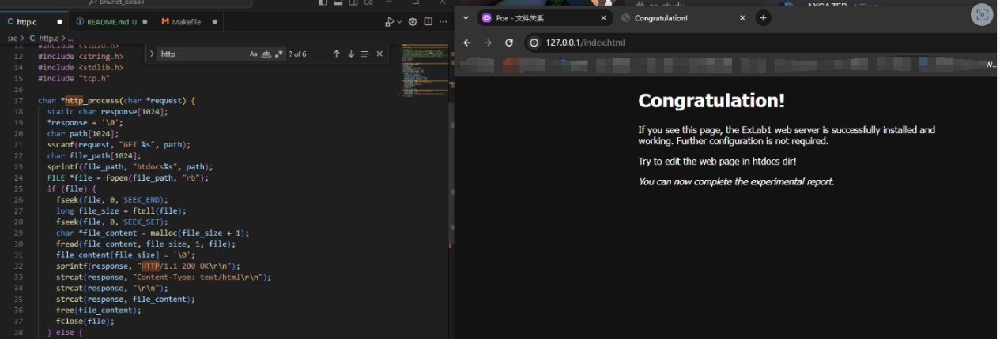
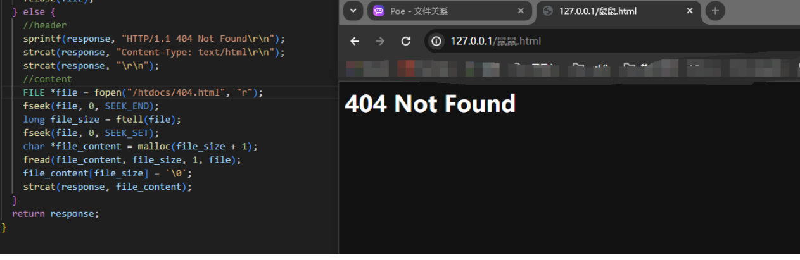

https://github.com/scatyf3/bnunet_exlab1

# 简单的http通信

在这个实验里，你将实现一个简单的http通信

>虽然不能做cs人的至高目标——造轮子，但是可以用轮子，比起做题，也是件令人开心的事情~

# 代码分析

在tcp里，它调用待我们实现的函数`char *http_process(char *request)`，在这个函数中，我们需要解析http请求并返回请求结果

# 完成基本功能

在http中，首先我们对request进行字符串匹配`sscanf(request, "GET %s", path);`,获得GET请求要求的具体路径，然后通过fopen调用浏览器请求的路径和我们本地网页储存路径连缀起来的结果

- 若是查找到文件，则我们将response和含有200 OK状态码的头文件和文件内容的文本化连缀起来，然后作为response交给tcp层
- 若是查找不到文件，则我们将失败的response（都是404.html）和含有404 状态码的头文件和文件内容的文本化连缀起来，然后作为response交给tcp层

